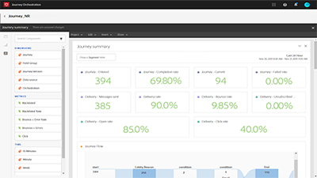

# Übersicht

[!UICONTROL Journey Orchestration] ist ein in Adobe Experience Platform integrierter Anwendungsdienst. Damit können Sie Anwendungsfälle für die Echtzeit-Orchestrierung der Customer Journey mithilfe von Kontextdaten erstellen, die in Ereignissen oder Datenquellen gespeichert sind.

## Neue Funktionen

* **[Aktion des Aktualisierens von Profilen](/help/building-a-journey/update-profile-action.md)**
* **[Zu einer anderen Journey springen](/help/building-a-journey/jumping-to-another-journey.md)**
    
   *Erfahren Sie, wie Sie Kontakte von einer Journey zur nächsten bewegen.*

## Mitarbeiterauswahl

<table>
<tr>
  <td>
    
    

      <a href="./understanding-journey-orchestration.md">
    <strong>Informationen zu Journey Orchestration</strong>
    </a>
    

    

    <em>Machen Sie sich mit dem Konzept der Journey Orchestration, den Anwendungsfällen, die diese unterstützt, und den Schlüsselelementen ihrer Funktionsweise vertraut.</em>
    

  </td>
  <td>
    
    

      <a href="./building-a-journey/creating-a-journey.md">
    <strong>Eine Journey erstellen (Video)</strong>
    </a>
    

    

    <em>Erfahren Sie, wie Sie eine Journey erstellen, mit einem Ereignis beginnen, Orchestrierungen zur Steuerung von Fluss und Zeitpunkt einer Journey verwenden und Aktionen verwenden, um an verschiedenen Punkten im Journey zu interagieren.</em>
    

  </td>
  <td>
   
    

      <a href="./analyze-a-journey-via-reporting-tools.md">
    <strong>Eine Journey mit Reporting-Tools analysieren</strong>
    </a>
    

    

    <em>Erfahren Sie, wie Sie zum Reporting für Ihre Journey navigieren, Datumsbereiche für Ihren Bericht auswählen und eine Reporting-Vorlage zur zukünftigen Verwendung speichern können. </em>
    

  </td>
</tr>
</table>

## Zusätzliche Ressourcen

* [Journey Orchestration Help Center](https://experienceleague.adobe.com/docs/journeys/using/journey-orchestration-home.html?lang=de)
* [Adobe Experience Platform-Tutorials](https://experienceleague.adobe.com/docs/platform-learn/tutorials/overview.html?lang=en)
